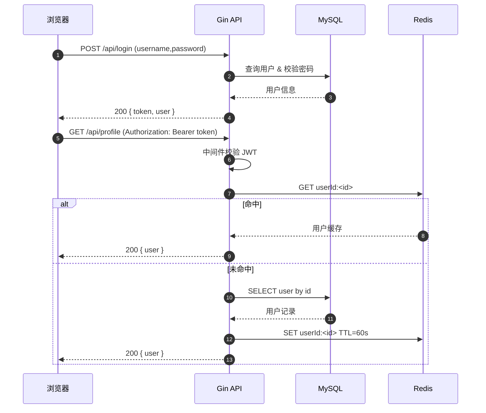

      今天来使用go中的jwt来完成用户的登录注册，并使用redis缓存用户信息的功能

项目地址：

- https://github.com/codepzj/go-jwt-redis-demo.git

## 背景与目标

- 本项目用 Gin + GORM + MySQL + Redis 实现一套“JWT 认证 + 用户资料缓存”的最小闭环：
  - 注册/登录获取 JWT
  - 中间件校验 JWT 保护接口
  - 访问资料时优先读 Redis 缓存，未命中则查询数据库 并回填缓存

## 配置加载

- 通过环境变量覆盖默认值（JWT 密钥、MySQL、Redis 等）：

```go
package config

import (
	"os"
)

type Config struct {
	JWTSecret    string
	DBHost       string
	DBPort       string
	DBUser       string
	DBPassword   string
	DBName       string
	RedisHost    string
	RedisPort    string
	RedisPassword string
	RedisDB      int
}

var AppConfig Config

func InitConfig() {
	AppConfig = Config{
		JWTSecret:     getEnv("JWT_SECRET", "codepzj"),
		DBHost:        getEnv("DB_HOST", "localhost"),
		DBPort:        getEnv("DB_PORT", "3306"),
		DBUser:        getEnv("DB_USER", "root"),
		DBPassword:    getEnv("DB_PASSWORD", "123456"),
		DBName:        getEnv("DB_NAME", "mytest2"),
		RedisHost:     getEnv("REDIS_HOST", "localhost"),
		RedisPort:     getEnv("REDIS_PORT", "6379"),
		RedisPassword: getEnv("REDIS_PASSWORD", ""),
		RedisDB:       0,
	}
}

func getEnv(key, defaultValue string) string {
	if value := os.Getenv(key); value != "" {
		return value
	}
	return defaultValue
}
```

## 数据库与 Redis 初始化

- 初始化 MySQL 连接并记录日志；初始化 Redis 客户端并 `Ping` 测试连接。

```go
func InitRedis() {
	RedisClient = redis.NewClient(&redis.Options{
		Addr:     fmt.Sprintf("%s:%s", config.AppConfig.RedisHost, config.AppConfig.RedisPort),
		Password: config.AppConfig.RedisPassword,
		DB:       config.AppConfig.RedisDB,
	})

	// 测试Redis连接
	_, err := RedisClient.Ping(context.Background()).Result()
	if err != nil {
		log.Fatal("Redis连接失败:", err)
	}

	log.Println("Redis连接成功")
}
```

## 模型与密码加密

- `User` 模型唯一索引用户名/邮箱，注册时对密码进行 `bcrypt` 加密；登录比对哈希。

```go
// 密码加密
func (u *User) HashPassword() error {
	hashedPassword, err := bcrypt.GenerateFromPassword([]byte(u.Password), bcrypt.DefaultCost)
	if err != nil {
		return err
	}
	u.Password = string(hashedPassword)
	return nil
}

// 验证密码
func (u *User) CheckPassword(password string) bool {
	err := bcrypt.CompareHashAndPassword([]byte(u.Password), []byte(password))
	return err == nil
}
```

## JWT：签发与校验

- 签发时将用户 `ID/Username` 写入自定义 `Claims`，过期时间 24 小时，HS256 对称签名；校验时解出 `Claims`。

```go
type Claims struct {
	UserID   uint   `json:"user_id"`
	Username string `json:"username"`
	jwt.RegisteredClaims
}	

// 生成JWT Token
func GenerateToken(userID uint, username string) (string, error) {
	claims := Claims{
		UserID:   userID,
		Username: username,
		RegisteredClaims: jwt.RegisteredClaims{
			ExpiresAt: jwt.NewNumericDate(time.Now().Add(24 * time.Hour)), // 24小时过期
			IssuedAt:  jwt.NewNumericDate(time.Now()),
			NotBefore: jwt.NewNumericDate(time.Now()),
		},
	}

	token := jwt.NewWithClaims(jwt.SigningMethodHS256, claims)
	return token.SignedString([]byte(config.AppConfig.JWTSecret))
}
```

```go
// 验证JWT Token
func ValidateToken(tokenString string) (*Claims, error) {
	token, err := jwt.ParseWithClaims(tokenString, &Claims{}, func(token *jwt.Token) (interface{}, error) {
		return []byte(config.AppConfig.JWTSecret), nil
	})

	if err != nil {
		return nil, err
	}

	if claims, ok := token.Claims.(*Claims); ok && token.Valid {
		return claims, nil
	}

	return nil, errors.New("无效的token")
}
```

## 鉴权中间件：保护接口

- 从 `Authorization: Bearer <token>` 提取 token，校验后把 `user_id/username` 放入上下文，用于后续处理。

```go
// 认证中间件
func AuthMiddleware() gin.HandlerFunc {
	return func(c *gin.Context) {
		authHeader := c.GetHeader("Authorization")
		if authHeader == "" {
			c.JSON(http.StatusUnauthorized, gin.H{"error": "缺少Authorization头"})
			c.Abort()
			return
		}

		// 检查Bearer前缀
		tokenParts := strings.Split(authHeader, " ")
		if len(tokenParts) != 2 || tokenParts[0] != "Bearer" {
			c.JSON(http.StatusUnauthorized, gin.H{"error": "无效的Authorization格式"})
			c.Abort()
			return
		}

		tokenString := tokenParts[1]
		claims, err := utils.ValidateToken(tokenString)
		if err != nil {
			c.JSON(http.StatusUnauthorized, gin.H{"error": "无效的token"})
			c.Abort()
			return
		}

		// 将用户信息存储到上下文中
		fmt.Println("user_id", claims.UserID)
		c.Set("user_id", claims.UserID)
		c.Set("username", claims.Username)
		c.Next()
	}
}
```

## 路由与模块装配

- 公开 API：注册、登录；保护 API：获取资料、登出、更新资料；并挂载静态演示页。

```go
// 公开路由
public := r.Group("/api")
{
	public.POST("/register", handlers.Register)
	public.POST("/login", handlers.Login)
}

// 需要认证的路由
protected := r.Group("/api")
protected.Use(middleware.AuthMiddleware())
{
	protected.GET("/profile", handlers.GetProfile)
	protected.POST("/logout", handlers.Logout)
	protected.PUT("/profile", handlers.UpdateProfile)
}
```

## 登录与签发 Token

- 登录成功后返回 `token` 与用户信息：

```go
// 登录处理器
func Login(c *gin.Context) {
	var req models.LoginRequest
	if err := c.ShouldBindJSON(&req); err != nil {
		c.JSON(http.StatusBadRequest, gin.H{"error": "请求参数错误: " + err.Error()})
		return
	}

	// 查找用户
	var user models.User
	if err := database.DB.Where("username = ?", req.Username).First(&user).Error; err != nil {
		c.JSON(http.StatusUnauthorized, gin.H{"error": "用户名或密码错误"})
		return
	}

	// 验证密码
	if !user.CheckPassword(req.Password) {
		c.JSON(http.StatusUnauthorized, gin.H{"error": "用户名或密码错误"})
		return
	}

	// 生成JWT token
	token, err := utils.GenerateToken(user.ID, user.Username)
	if err != nil {
		c.JSON(http.StatusInternalServerError, gin.H{"error": "Token生成失败"})
		return
	}

	c.JSON(http.StatusOK, gin.H{
		"message": "登录成功",
		"token":   token,
		"user":    user.ToResponse(),
	})
}
```

## 使用 Redis 做用户资料缓存

- 访问 `GET /api/profile` 时：
  - 先读 Redis `userId:<id>`，命中则直接返回；
  - 未命中则查 DB 并以 TTL=1 分钟回填缓存。

```go
// 获取用户资料
func GetProfile(c *gin.Context) {
	userId, exists := c.Get("user_id")
	// ... 省略鉴权存在性与类型断言检查 ...

	//从redis获取
	val, err := database.RedisClient.Get(c, fmt.Sprintf("userId:%d", userIdVal)).Result()
	if err == nil {
		var userStru models.User
		if err := json.Unmarshal([]byte(val), &userStru); err != nil {
			c.JSON(http.StatusInternalServerError, gin.H{
				"message": err.Error(),
			})
			return
		}

		c.JSON(http.StatusOK, gin.H{
			"user": userStru.ToResponse(),
		})
		return
	}

	var user models.User
	if err := database.DB.First(&user, userIdVal).Error; err != nil {
		c.JSON(http.StatusNotFound, gin.H{"error": "用户不存在"})
		return
	}

	// 将user置入redis
	userBytes, err := json.Marshal(user)
	// ... 省略错误处理 ...
	if err := database.RedisClient.Set(c, fmt.Sprintf("userId:%d", userIdVal), userBytes, time.Minute).Err(); err != nil {
		// ... 错误处理 ...
		return
	}

	c.JSON(http.StatusOK, gin.H{
		"user": user.ToResponse(),
	})
}
```


## 时序与数据流

- 简图说明（登录与访问资料）：



今天的教程就到这里，这只是一个demo，大概熟悉一下redis如何使用